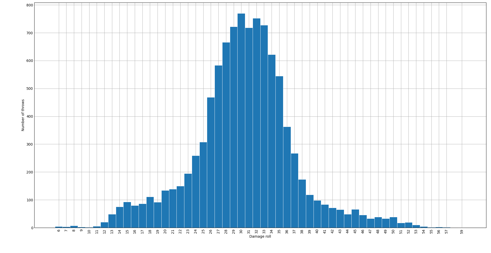

# DnD 5e attack die roller
A simple Python CLI tool to roll die and (optionally) show the distribution of damage rolls on N amount of throws.

Given a list of die throws for attacks, this application will throw the attack rolls and damage rolls associated and then print a tabular representation of each into the stdout.

## Installation
As dependencies I am using `matplotlib` to be able to plot the damage distribution on a bar chart. And `tabulate` to show a pretty representation of the attack outcomes.

1. Clone the repository using `git clone`
2. Open a terminal in the cloned repository folder and create a virtual environment with the tool of your choice. I'll use `virtualenv`:
    ```shell
    $ virtualenv venv
    ```
3. Now activate the virtual environment
    ```shell
    $ source venv/bin/activate
    ```
4. Now install the dependencies using pip and the `requirements.txt` file:
    ```shell
    $ (venv) pip install -r requirements.txt
    ```
5. Once that's installed, you'll be able to run the CLI tool from the command line. Refer to the following sections to learn how to do that

## Usage
### Single attack
To make a single attack simply run this in the console:

```shell
$ python main.py 1d4
```

This would show an output like this:

```shell
$ python main.py 1d4
+------------------------+--------------------+
|   Making an attack for | 1d4                |
+========================+====================+
|            Attack type | Normal             |
|       Attack condition | Normal             |
|            Attack roll | 12 + 0 = 12 vs AC  |
|            Damage roll | 2 points of damage |
+------------------------+--------------------+
Total damage with these attacks: 2 points of damage
```

There is not a limit to the number of attacks you can make with this feature.

### Multiple attacks
Following the idea of the section about single attack throws, we can pass in several attacks using the same format, space separated.
To make a single attack simply run this in the console:

```shell
$ python main.py 1d10+5 2d4+5
```

This would show an output like this:

```shell
$ python main.py 1d10+5 2d4+5
+------------------------+---------------------+
|   Making an attack for | 1d10+5              |
+========================+=====================+
|            Attack type | Normal              |
|       Attack condition | Normal              |
|            Attack roll | 8 + 0 = 8 vs AC     |
|            Damage roll | 11 points of damage |
+------------------------+---------------------+
+------------------------+---------------------+
|   Making an attack for | 2d4+5               |
+========================+=====================+
|            Attack type | Normal              |
|       Attack condition | Normal              |
|            Attack roll | 18 + 0 = 18 vs AC   |
|            Damage roll | 11 points of damage |
+------------------------+---------------------+
Total damage with these attacks: 22 points of damage
```

### Adding an attack modifier
In DnD 5e your characters will add an attack modifier, which is a value that adds to the d20 roll then making an attack roll. You can supply this information to the program by using the `--attack-modifier` parameter.

You'll see that the integer value you supply is then added to the d20 roll that makes the attack roll result.

```shell
$ python main.py 1d10+5 3d4+5 --attack-modifier 5
+------------------------+--------------------+
|   Making an attack for | 1d10+5             |
+========================+====================+
|            Attack type | Normal             |
|       Attack condition | Normal             |
|            Attack roll | 3 + 5 = 8 vs AC    |
|            Damage roll | 8 points of damage |
+------------------------+--------------------+
+------------------------+---------------------+
|   Making an attack for | 3d4+5               |
+========================+=====================+
|            Attack type | Normal              |
|       Attack condition | Normal              |
|            Attack roll | 18 + 5 = 23 vs AC   |
|            Damage roll | 14 points of damage |
+------------------------+---------------------+
Total damage with these attacks: 22 points of damage
```

### Rolling with Advantage / Disadvantage
In DnD you can also roll with advantage or disadvantage. This allows you to throw an extra d20 when making the attack and choose the maximum or minimum value, respectively.

So if we were to get `14` and `3` as our two d20 rolls, with advantage we would use `14` and with disadvantage, we would use `3`. 

This is supported in this CLI by providing an 'A' character for advantage and 'D' for disadvantage. You can add one of these characters at the end of an attack definition. Like so:

```shell
$ python main.py 1d10+5A 3d4+5D 1d4+5 --attack-modifier 5
+------------------------+---------------------+
|   Making an attack for | 1d10+5              |
+========================+=====================+
|            Attack type | Normal              |
|       Attack condition | Advantage           |
|            Attack roll | 10 + 5 = 15 vs AC   |
|            Damage roll | 14 points of damage |
+------------------------+---------------------+
+------------------------+---------------------+
|   Making an attack for | 3d4+5               |
+========================+=====================+
|            Attack type | Normal              |
|       Attack condition | Disadvantage        |
|            Attack roll | 18 + 5 = 23 vs AC   |
|            Damage roll | 13 points of damage |
+------------------------+---------------------+
+------------------------+--------------------+
|   Making an attack for | 1d4+5              |
+========================+====================+
|            Attack type | Normal             |
|       Attack condition | Normal             |
|            Attack roll | 8 + 5 = 13 vs AC   |
|            Damage roll | 8 points of damage |
+------------------------+--------------------+
Total damage with these attacks: 35 points of damage
```

### Forcing critical hit attacks
You can also force the attacks into being critical hits. That is, rolling a natural 20 in the d20 for the attack roll. In that case you have to set the `--force-critical-hit` flag. Then the output would look something like this:

```shell
$ python main.py 1d10+5A 3d4+5D 1d4+5 --attack-modifier 5 --show-distribution --force-critical-hit
+------------------------+---------------------+
|   Making an attack for | 1d10+5              |
+========================+=====================+
|            Attack type | Critical            |
|       Attack condition | Advantage           |
|            Attack roll | 20 + 5 = 25 vs AC   |
|            Damage roll | 16 points of damage |
+------------------------+---------------------+
+------------------------+---------------------+
|   Making an attack for | 3d4+5               |
+========================+=====================+
|            Attack type | Critical            |
|       Attack condition | Disadvantage        |
|            Attack roll | 20 + 5 = 25 vs AC   |
|            Damage roll | 30 points of damage |
+------------------------+---------------------+
+------------------------+---------------------+
|   Making an attack for | 1d4+5               |
+========================+=====================+
|            Attack type | Critical            |
|       Attack condition | Normal              |
|            Attack roll | 20 + 5 = 25 vs AC   |
|            Damage roll | 14 points of damage |
+------------------------+---------------------+
Total damage with these attacks: 60 points of damage
```

### Plotting damage rolls distribution
If you are extra interested about knowing what's the average potential of the attack throws you make, you can set the `--show-distribution` flag. The program will then make n amount of throws for those attacks using the value defined in the `--throws` parameter (it has a default value of `10000`).

These rolls will then be represented into a simple bar chart, shown to you before the program ends and after printing the actual rolls into the stdout.

Here is a sample image of that plot:

